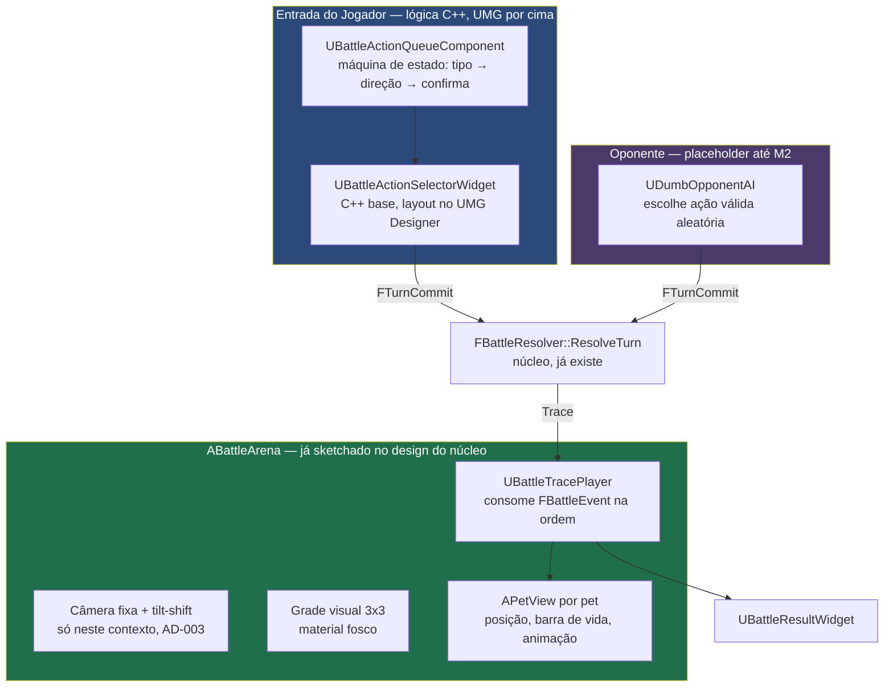

# Apresentação do Combate — Design

**Spec:** `.specs/features/apresentacao-combate/spec.md`
**Status:** ✅ Aprovado (2026-08-25)
**Decisões que constrangem este design:** AD-003 (arte Link's Awakening, ressalva de tilt-shift por contexto), AD-009 (ação = Tipo+Direção), BTL-22/P7 (apresentação nunca recalcula)

---

## Limite de Ferramenta — Lido Antes de Desenhar

Este design separa duas coisas de propósito, porque a fronteira entre elas é real, não estilística:

| Camada | Quem escreve | Como se verifica |
|---|---|---|
| **Lógica** (máquina de estado da fila, IA burra, tocador de trace, câmera fixa) | C++, por mim, nesta sessão | Testes automatizados headless — mesmo padrão do Combate Núcleo e do Backend de Pet |
| **Layout visual** (posição de botão, estilo, UMG Designer) | Requer o editor Unreal aberto com autoria visual — você, ou eu via MCP quando a Fase de Tarefas chegar nisso | Inspeção visual no editor, não automatizável do jeito que os testes de lógica são |

Todo componente abaixo já nasce com essa divisão marcada.

---

## Visão da Arquitetura



**Regra dura herdada do BTL-22:** `UBattleTracePlayer` só lê campos do `FBattleEvent`. Nenhum componente desta feature reimplementa fórmula de dano, alcance ou resultado — se um widget precisa de um número, ele vem do evento, não de um cálculo local. Verificável pela mesma sonda em espírito do `AD-012` (ver Estratégia de Verificação).

---

## Code Reuse Analysis

| Existente | Local | Como se aplica |
|---|---|---|
| `FBattleResolver::ResolveTurn` | `BattleSim` | Chamado sem alteração — esta feature é consumidora, não modifica o núcleo |
| `FBattleEvent`, `EBattleEventType` | `BattleSim` | Fonte de todo dado exibido |
| `FTurnCommit`, `FBattleAction`, `EActionType`, `EBattleDirection` | `BattleSim` | A fila de ação da UI produz exatamente este formato |
| `FPetPresentationInfo` (nome, `FGameplayTag` de tipo) | `BattleSquare`, já existe do Backend de Pet | Alimenta a exibição de nome/tipo do pet em tela |
| `FBattleDataTranslator::TranslatePet` | `BattleSquare` | Usado para montar os `FPetState` iniciais da demonstração |

Nenhum componente de UI existe ainda no projeto — esta é a primeira feature de apresentação.

---

## Componentes

### `UBattleActionQueueComponent` — máquina de estado da fila (lógica pura, testável)

- **Propósito:** administrar a seleção em 2 passos (PRES-01) e o estado da fila (0 a 3 ações, travada após commit).
- **Local:** `Source/BattleSquare/Public/Battle/BattleActionQueueComponent.h`
- **Interface:**
  - `bool BeginSelectingType(EActionType Type)` — inicia o passo 1; se o tipo não precisar de direção, já confirma e retorna
  - `bool ConfirmDirection(EBattleDirection Direction)` — completa o passo 2, adiciona à fila
  - `bool CancelPendingSelection()` — volta do passo 2 pro passo 1, sem afetar ações já confirmadas (PRES-02)
  - `bool RemoveLastAction()` — desfaz só a última (BTL-01, critério 3)
  - `bool Commit()` — trava a fila, preenche o resto com Aguardar se incompleta (BTL-20/edge case)
  - `FTurnCommit BuildCommit() const`
  - Delegates: `OnQueueChanged`, `OnCommitted` — para o widget reagir sem a lógica saber de UMG
- **Por que é um `UActorComponent`, não parte do widget:** a lógica da fila não depende de nada visual — isolar assim é o que permite testar sem UMG Designer, sem editor, do mesmo jeito que `BattleSim` foi isolado do `Engine`.

### `UDumbOpponentAI` — oponente placeholder (lógica pura, testável)

- **Propósito:** produzir um `FTurnCommit` válido para o lado oponente, sem depender de rede (M2) nem de jogador humano.
- **Local:** `Source/BattleSquare/Public/Battle/DumbOpponentAI.h`
- **Interface:** `static FTurnCommit GenerateRandomValidCommit(const FBattleState& State, uint8 Side, FBattleRandom& Random)`
- **Regra:** usa o `FBattleRandom` do próprio `FBattleState` — nunca `FMath::Rand` (AD-004). "Burra" de propósito: escolhe entre as ações que fazem sentido geometricamente (não tenta sair da grade), mas não joga estrategicamente. Documentado como descartável quando M2 trouxer jogador real.

### `ABattleArena` — já no design do núcleo, detalhado agora

- **Propósito:** monta a cena (câmera, grade, pets), inicia a partida, delega a animação ao `UBattleTracePlayer`.
- **Local:** `Source/BattleSquare/Public/Battle/BattleArena.h` (já previsto)
- **Novidade deste design:** possui a câmera fixa com tilt-shift (post-process, só nesta cena — AD-003) e instancia um `APetView` por pet a partir de `FPetPresentationInfo` + `FBattleState` inicial.

### `UBattleTracePlayer` — o tocador do trace

- **Propósito:** consumir `TArray<FBattleEvent>` na ordem, agrupando por `SlotIndex`+`Phase` para simultaneidade (PRES-09).
- **Local:** `Source/BattleSquare/Public/Battle/BattleTracePlayer.h`
- **Interface:** `void PlayTrace(const TArray<FBattleEvent>& Trace)`, `void SkipToEnd()` (mesma interface já prevista para `ABattleArena` — movida para um componente próprio porque a lógica de agrupar por fase é grande o bastante para merecer seu próprio arquivo, testável isolado do resto da arena)
- **Regra dura:** despacha eventos para `APetView` via chamadas que só passam o `Value`/`FromCell`/`ToCell` do evento — nunca um número calculado aqui.

### `APetView` — representação visual de um pet

- **Propósito:** posição na grade, barra de vida, reação a eventos (`Moveu`, `AtaqueAcertou`, `PetMorreu`...).
- **Local:** `Source/BattleSquare/Public/Battle/PetView.h`
- **Interface:** `void ApplyEvent(const FBattleEvent& Event)`, `void SetInitialState(const FPetState&, const FPetPresentationInfo&)`
- **Camada visual (UMG Designer):** a barra de vida em si (widget) é autorada visualmente; `APetView` só expõe `UPROPERTY(BlueprintReadOnly) float HealthRatio` para o widget consumir via binding.

### `UBattleActionSelectorWidget`, `UBattleResultWidget` — UMG, C++ base

- **Propósito:** camada visual dos passos 1 e 2 de seleção, e da tela de resultado.
- **Local:** `Source/BattleSquare/Public/UI/`
- **Regra:** a classe C++ expõe `UFUNCTION(BlueprintCallable)` para cada ação do `UBattleActionQueueComponent` e `UPROPERTY(BlueprintReadOnly)` para o estado atual — o layout (posição dos 6 botões de tipo, o seletor de 8 direções) é autorado no UMG Designer, **fora do escopo do que eu escrevo em C++ puro**.

---

## Modelos de Dados

### Estado da seleção (só em C++, não persiste no núcleo)

```cpp
UENUM()
enum class EActionSelectionStep : uint8
{
    ChoosingType,       // passo 1
    ChoosingDirection,  // passo 2, só se o tipo escolhido precisar
};

USTRUCT()
struct FPendingActionSelection
{
    GENERATED_BODY()
    EActionSelectionStep Step = EActionSelectionStep::ChoosingType;
    EActionType SelectedType = EActionType::Aguardar;
};
```

### Agrupamento de eventos por fase (dentro de `UBattleTracePlayer`)

```cpp
// Eventos do MESMO SlotIndex + Phase tocam juntos (PRES-09, critério 2).
// Construído a partir do trace linear na primeira passada, sem alterar
// FBattleEvent nem o formato que o núcleo produz.
TArray<TArray<FBattleEvent>> GroupEventsByPhase(const TArray<FBattleEvent>& Trace);
```

---

## Tratamento de Erro

| Cenário | Tratamento | O que o jogador vê |
|---|---|---|
| Jogador tenta selecionar com fila em 3/3 | `UBattleActionQueueComponent` recusa, delegate não dispara mudança | Botões de tipo desabilitados, "3/3" visível (PRES-03) |
| Jogador cancela no passo 2 | Volta ao passo 1, fila anterior intacta | Sem nenhuma ação perdida |
| Commit com fila incompleta | Preenche com Aguardar antes de travar | Aviso visual antes de confirmar (edge case da spec) |
| Ataque sem alvo (`AtaqueErrou`) | `APetView` mostra feedback de "errou", não de dano | Texto/ícone diferente de dano numérico |
| Pular animação no meio de morte mútua | `SkipToEnd()` aplica o `FBattleState` final direto, sem depender de animação intermediária ter rodado | Os dois pets já aparecem mortos |

---

## Decisões Técnicas

| Decisão | Escolha | Razão |
|---|---|---|
| Seleção de ação | 2 passos (tipo → direção condicional) | Resolve o problema de 12 botões sinalizado em AD-009, sem perder a expressividade do par (Tipo, Direção) |
| Fila como `UActorComponent` separado do widget | Sim | Testável sem UMG Designer nem editor — mesmo princípio de isolar lógica de apresentação (design do núcleo) |
| Oponente | IA burra, ação válida aleatória, usando o RNG do próprio `FBattleState` | Só existe para tornar a feature demonstrável antes de M2; nunca usa `FMath::Rand` (AD-004) |
| Tilt-shift | Só na cena de arena instanciada, não em mundo aberto | Ressalva já registrada em AD-003 — o efeito de diorama faz sentido em espaço fechado, briga com câmera livre de mundo aberto |
| Agrupamento por fase | Pré-processamento do trace linear em grupos, sem alterar `FBattleEvent` | Mantém o núcleo intocado; a necessidade de "tocar simultâneo" é só da apresentação |
| Barra de vida / dano flutuante | `APetView` expõe dados via `BlueprintReadOnly`, widget consome por binding | Padrão C++ base + Blueprint por cima, já documentado nas rules do usuário |

---

## Decisões Pendentes

### DP-08: Layout final do seletor de 8 direções

- **Proposta:** roseta radial ao redor de um botão central de confirmação — funciona por toque (arrastar) e por clique (8 alvos fixos).
- **Alternativa:** D-pad de 8 botões em grade 3x3 (com o centro vazio) — mais simples de implementar no UMG Designer, menos elegante.
- **Decisão adiada para a autoria visual** (fora do que C++ resolve) — qualquer uma das duas é compatível com `UBattleActionQueueComponent::ConfirmDirection`, a interface não muda.

### DP-09: Câmera ortográfica ou perspectiva com FOV estreito

- **Proposta:** perspectiva com FOV baixo (~25-30°) simulando ortográfica — mantém profundidade sutil (bom para o tilt-shift) sem a rigidez total de uma câmera ortográfica pura.
- **Impacto se mudar depois:** baixo, é ajuste de `ACameraActor` dentro de `ABattleArena`, não estrutural.

---

## Estratégia de Verificação

1. **`UBattleActionQueueComponent`** — testes automatizados headless: os 2 passos, cancelamento, limite 3/3, commit com preenchimento automático. Mesmo padrão dos 53 testes já existentes.
2. **`UDumbOpponentAI`** — teste automatizado: toda ação gerada é válida (não tenta sair da grade), usa exclusivamente `FBattleRandom` (auditável pela mesma sonda anti-float/anti-rand do núcleo).
3. **`UBattleTracePlayer` — agrupamento por fase** — teste automatizado: trace de exemplo com eventos simultâneos e sequenciais, confere o agrupamento sem depender de nenhuma renderização.
4. **Sonda "nenhum recálculo"** — grep disciplinado por padrões de fórmula (`* Attack`, `- Defense`, etc.) fora de `BattleSim`, mesmo espírito do `audit_determinism.sh`.
5. **Camada visual (widgets, câmera, material)** — verificação manual no editor. Não fingir cobertura automatizada onde não existe; registrar explicitamente o que só se prova olhando.
