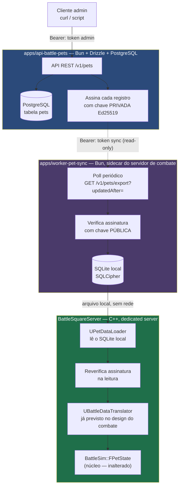

# Backend de Dados de Pet — Design

**Spec:** `.specs/features/backend-dados-pet/spec.md`
**Status:** Draft — aguarda aprovação antes da quebra em tarefas
**Decisões que constrangem este design:** AD-014 (dois sistemas, espelho local), AD-015 (stack segue nodejs.md/apis.md/database.md), AD-016 (criptografia + integridade), AD-017 (adulteração é sinal, não vetor de trapaça)

---

## Visão da Arquitetura

Quatro processos, três fronteiras de confiança.



**As três fronteiras de confiança:**
1. **Admin → Backend**: token com escopo de escrita, curta duração, rotacionável (security.md §2)
2. **Sync → Backend**: token separado, escopo só-leitura — mesmo que vaze, não permite escrever pets
3. **Servidor de combate → Espelho local**: nunca é rede. É leitura de arquivo, com reverificação de assinatura na hora de ler — defesa em profundidade contra adulteração pós-sync (AD-017)

**Por que Ed25519 assimétrico, não HMAC simétrico (refina PETDB-10):** com HMAC, qualquer verificador precisaria da mesma chave secreta que assina — se o sidecar de sync ou o servidor de combate fossem comprometidos, o atacante ganharia a capacidade de **forjar** assinaturas novas, não só ler as existentes. Com Ed25519, só o backend guarda a chave privada; sidecar e servidor de combate só têm a chave pública, que serve apenas para conferir. Comprometer um verificador nunca dá poder de forjar.

---

## Code Reuse Analysis

Projeto novo (backend) — nada a reusar em código. Reuso é de **convenção documentada**:

| Convenção | Fonte | Como se aplica aqui |
|---|---|---|
| `Bun.serve`, sem Express/Fastify | `code-standart.md` §2 | `apps/api-battle-pets` usa `Bun.serve` puro |
| Sufixo de papel no nome do arquivo | `code-standart.md` §1 | `pet.schema.ts`, `pet.use-case.ts`, `pet.controller.ts` |
| `apps/` com prefixo `api-`/`worker-` | `code-standart.md` §2 | `apps/api-battle-pets/`, `apps/worker-pet-sync/` |
| PK em UUID, proibido ENUM nativo | `code-standart.md` §8 | tabela `pets`: `id uuid`, `type varchar` |
| Envelope de resposta, erros de uma vez | `apis.md` | `{data}`/`{error}`, `400` lista todos os campos inválidos |
| Token de vida curta, escopo enumerado | `security.md` §2 | dois tokens (admin, sync), não um curinga |
| Zod na fronteira | `nodejs.md`, `apis.md` | todo body/query validado antes de tocar o use-case |

### Pontos de Integração

| Sistema | Método |
|---|---|
| `BattleSim::FPetState` (combate núcleo) | `UBattleDataTranslator` — já previsto no design do Combate Núcleo, ganha a implementação real aqui |
| `BattleSquareServer` (dedicated server) | Novo componente `UPetDataLoader`, módulo `BattleSquare` (nunca `BattleSim` — a fronteira do núcleo continua intacta) |

---

## Componentes

### `apps/api-battle-pets` — Backend, fonte da verdade

- **Propósito:** CRUD de pets, servido por API REST.
- **Stack:** `Bun.serve`, Drizzle + PostgreSQL, Zod.
- **Interfaces:**
  - `POST /v1/pets` — cria
  - `GET /v1/pets?page=&perPage=&updatedAfter=` — lista, paginado, filtro incremental
  - `GET /v1/pets/:id` — busca um
  - `PUT /v1/pets/:id` — atualiza
  - `DELETE /v1/pets/:id` — remove
  - `GET /v1/pets/export?updatedAfter=` — usado só pelo sync sidecar; inclui assinatura Ed25519 por registro
- **Dependências:** PostgreSQL, chave privada Ed25519 (env var, nunca versionada)

### `apps/worker-pet-sync` — Sidecar de sincronização

- **Propósito:** manter o espelho local atualizado, verificando cada registro antes de gravar.
- **Stack:** `Bun`, cliente SQLite com suporte a SQLCipher.
- **Comportamento:** poll periódico (intervalo configurável); ao iniciar, faz sync completo antes de sinalizar "pronto" para o servidor de combate; se o backend estiver inacessível, mantém o espelho existente e tenta de novo no próximo ciclo (PETDB-08).
- **Dependências:** chave pública Ed25519 (pode ser distribuída livremente), chave de criptografia do SQLCipher (compartilhada com o servidor de combate por configuração local, não por rede)

### `UPetDataLoader` — Leitor do espelho, lado Unreal

- **Propósito:** ler o SQLite local, reverificar assinatura, entregar dados prontos para `UBattleDataTranslator`.
- **Local:** `Source/BattleSquare/Public/Data/PetDataLoader.h` (módulo `BattleSquare`, nunca `BattleSim`)
- **Regra dura:** se um registro falhar a reverificação de assinatura na leitura, é descartado e logado como possível violação (PETDB-10) — nunca chega ao `BattleSim`.
- **Dependências:** biblioteca SQLite/SQLCipher linkada como third-party (`unreal-thirdparty` skill cobre o padrão de integração), biblioteca Ed25519 (ex.: libsodium, já comum em integrações third-party de Unreal)

---

## Modelos de Dados

### Tabela `pets` (PostgreSQL, via Drizzle)

```ts
// apps/api-battle-pets/src/pet/pet.schema.ts
export const pets = pgTable('pets', {
  id: uuid('id').primaryKey().defaultRandom(),
  name: varchar('name', { length: 80 }).notNull(),
  type: varchar('type', { length: 40 }).notNull(), // sem enum nativo — code-standart.md §8
  attack: integer('attack').notNull(),
  defense: integer('defense').notNull(),
  speed: integer('speed').notNull(),
  maxHealth: integer('max_health').notNull(),
  createdAt: timestamp('created_at').defaultNow().notNull(),
  updatedAt: timestamp('updated_at').defaultNow().notNull(),
});
```

### Payload de exportação (assinado, servido por `/v1/pets/export`)

```ts
type SignedPetExport = {
  id: string;
  name: string;
  type: string;
  attack: number;
  defense: number;
  speed: number;
  maxHealth: number;
  updatedAt: string; // ISO 8601
  signature: string; // Ed25519, sobre o JSON canônico dos campos acima
};
```

### Espelho local (SQLite, mesmo shape + coluna de verificação)

Mesma estrutura do payload assinado — o espelho **é** o payload persistido, não uma transformação dele. Isso elimina uma classe inteira de bug de tradução entre "o que o backend assinou" e "o que ficou gravado".

### Tradução para `FPetState` (núcleo, todos inteiros — ver `BattleState.h`)

| Campo remoto | Campo `FPetState` | Nota |
|---|---|---|
| `attack`, `defense`, `speed`, `maxHealth` | idem | já inteiros — sem conversão |
| `maxHealth` | `Health` **e** `MaxHealth` | no início da batalha, `Health = MaxHealth` |
| `type` (string) | — | vira `FGameplayTag` na camada `BattleSquare` (AD-008/AD-012) — nunca entra no núcleo como string nem como tag |
| `id` (uuid) | `PetId` (uint8) | precisa de mapeamento uuid → índice local de 8 bits por batalha — ver Decisões Pendentes |

---

## Tratamento de Erro

| Cenário | Tratamento | Efeito no jogo |
|---|---|---|
| Payload de criação/atualização inválido | `400`, todos os erros de campo de uma vez | Admin corrige tudo numa tentativa |
| Id não encontrado | `404`, código `PET_NOT_FOUND` | — |
| Backend inacessível durante sync periódico | Sidecar mantém espelho atual, tenta de novo no próximo ciclo | Partidas em andamento não são afetadas (PETDB-08) |
| Backend inacessível na primeira inicialização (espelho vazio) | Servidor de combate recusa iniciar partidas, erro explícito | Nenhuma partida silenciosamente quebrada com dado ausente (PETDB-06) |
| Assinatura não bate no sync sidecar | Registro descartado, não entra no espelho, logado | Pet fica com o dado antigo (se havia) ou ausente |
| Assinatura não bate na releitura pelo `UPetDataLoader` | Registro descartado, logado como possível violação | Defesa em profundidade — pega adulteração pós-sync |
| Cliente do jogador com cache local adulterado | Sessão encerrada, oponente vence por W.O. (AD-017) | Resultado da luta nunca foi afetado — servidor nunca confiou no cliente |

---

## Decisões Técnicas

| Decisão | Escolha | Razão |
|---|---|---|
| Assinatura | Ed25519 assimétrico, não HMAC | Comprometer um verificador não dá poder de forjar (refina PETDB-10) |
| Onde o espelho vive | Processo do servidor de combate, nunca no cliente do jogador | É a defesa primária contra adulteração — cliente nunca tem acesso de escrita |
| Sync: polling vs. push | Polling com intervalo configurável | Mais simples de operar em v1; push (webhook) é candidato de otimização, não requisito |
| Linguagem do sync sidecar | Bun/TypeScript, não C++ dentro do dedicated server | Reaproveita a stack e os padrões já documentados do usuário; mantém a superfície C++ do servidor pequena (só leitura do SQLite) |
| `type` do pet no núcleo | Nunca entra como string nem tag — só na camada `BattleSquare` | Mesma regra do AD-012: núcleo não conhece `GameplayTags` |

---

## Decisões Pendentes

### DP-06: Mapeamento `uuid` (backend) → `PetId: uint8` (núcleo)

- **Proposta:** o mapeamento é local a cada batalha — quando os pets são selecionados, o servidor de combate atribui um `PetId` de 8 bits sequencial (1, 2, 3...) só para aquela partida. O `uuid` nunca entra no `BattleSim`.
- **Alternativa:** hash do uuid truncado para 8 bits — arriscado (colisão), descartado.
- **Impacto se mudar depois:** baixo — é uma tabela de tradução na fronteira, não estrutura do núcleo.

### DP-07: Intervalo de sincronização do sidecar

- **Proposta:** 30 segundos. Balanceamento de pet não muda por segundo; 30s é rápido o bastante para uma sessão de ajuste ("mudei o pet, testo em meio minuto") sem gerar tráfego desnecessário.
- **Impacto:** só parâmetro de configuração.

---

## Estratégia de Verificação

1. **Contrato da API** — request/response de cada endpoint, incluindo os casos de erro (`400`, `404`)
2. **Assinatura** — round-trip: backend assina, sidecar verifica com sucesso; adulterar 1 byte do payload faz a verificação falhar
3. **Resiliência do sync** — backend derrubado no meio de um ciclo de poll não corrompe nem trava o espelho existente
4. **Fronteira do núcleo, de novo** — a mesma classe de sonda do AD-012: `UPetDataLoader` e `UBattleDataTranslator` vivem em `BattleSquare`; um teste de build garante que `BattleSim` continua sem depender de SQLite, rede, ou qualquer coisa deste backend
