# Combate Núcleo — Design

**Spec:** `.specs/features/combate-nucleo/spec.md`
**Status:** Draft — aguarda aprovação antes da quebra em tarefas
**Decisões que constrangem este design:** AD-004 (determinismo), AD-005 (servidor autoritativo), AD-008 (camada de dados), AD-009 (ação = Tipo + Direção), AD-011/AD-012 (fronteira do núcleo)

---

## Visão da Arquitetura

Três camadas, com uma fronteira dura entre a primeira e as outras duas.

```mermaid
graph TD
    subgraph BattleSquare["BattleSquare — Core, CoreUObject, Engine, EnhancedInput, GameplayTags"]
        UI[Seleção de Ações<br/>UMG]
        NET[BattleSession<br/>replicação]
        VIEW[ABattleArena<br/>anima o trace]
        DATA[DT_Pets · DA_Skill<br/>Gameplay Tags]
    end

    subgraph BattleSim["BattleSim — SOMENTE Core + CoreUObject"]
        RES[FBattleResolver<br/>função pura]
        STATE[FBattleState]
        RNG[FBattleRandom<br/>PCG semeado]
        TRACE[FBattleEvent&#91;&#93;]
    end

    UI -->|FTurnCommit| NET
    DATA -->|tradução tag → inteiro| STATE
    NET -->|State + 2 commits| RES
    RES --> STATE
    RES --> TRACE
    RNG --> RES
    TRACE -->|replicado| VIEW

    style BattleSim fill:#1f6f4a,color:#fff
    style BattleSquare fill:#2b4a7a,color:#fff
```



**A regra que sustenta tudo:** setas cruzam a fronteira só como **dados** (`FTurnCommit` entra, `FBattleEvent[]` sai). O `BattleSim` não conhece `UWorld`, `AActor`, replicação nem UI — e isso é imposto pelo build, não por disciplina (AD-012).

---

## Reuso e Pontos de Integração

Projeto novo — não há código a reusar. O que se reusa são **sistemas da engine**, e a escolha de cada um já está registrada:

| Sistema | Como é usado | Onde |
|---|---|---|
| `FTableRowBase` / `UDataTable` | Os 250 pets, importados de CSV versionado | `BattleSquare` |
| `UDataAsset` | Definição de skill | `BattleSquare` |
| `FGameplayTag` | Tipos, fraquezas, classificação — **nunca no núcleo** | `BattleSquare` |
| `EnhancedInput` | Entrada da seleção de ações | `BattleSquare` |
| Replicação nativa (RPC + `FFastArraySerializer`) | Commit e trace | `BattleSquare` |
| `IMPLEMENT_SIMPLE_AUTOMATION_TEST` (está em `Core`) | Testes do núcleo, sem editor | `BattleSim` ✅ verificado |

**Deliberadamente não usados:** GAS (AD-007), `UGameplayEffect`, `AbilitySystemComponent`.

---

## Componentes

### FBattleResolver — o núcleo

- **Propósito:** dado um estado e os dois commits, produzir o próximo estado e o trace. É a única coisa que decide o resultado de um combate.
- **Local:** `Source/BattleSim/Public/Battle/BattleResolver.h`
- **Forma:** função **estática e pura**. Sem membros, sem estado interno, sem singleton. Duas chamadas com a mesma entrada devolvem a mesma saída, sempre.

```cpp
struct FBattleResolveResult
{
    FBattleState        NextState;
    TArray<FBattleEvent> Trace;
};

class BATTLESIM_API FBattleResolver
{
public:
    static FBattleResolveResult ResolveTurn(
        const FBattleState& InState,
        const FTurnCommit&  LeftCommit,
        const FTurnCommit&  RightCommit);
};
```

- **Dependências:** `FBattleState`, `FTurnCommit`, `FBattleRandom`. Nada mais.
- **Estrutura interna:** um laço de 3 slots, cada slot chamando as cinco fases da spec (F1 Declaração, F2 Postura, F3 Movimento, F4 Combate, F5 Encerramento). Cada fase é uma função livre no `Private/`, testável isoladamente.

> **Por que estática e pura.** É o que torna o requisito BTL-16 (traces idênticos para mesma seed) verificável por teste em vez de por inspeção. Também é o que permite rodar 10.000 combates headless para balanceamento sem instanciar nada.

### FBattleRandom — aleatoriedade determinística

- **Propósito:** única fonte de aleatoriedade da simulação.
- **Local:** `Source/BattleSim/Public/Battle/BattleRandom.h`
- **Forma:** PRNG de estado explícito (`uint64`), avançado por valor e carregado dentro do `FBattleState`. **Não** usa `FMath::Rand`, `FRandomStream` global nem qualquer coisa com estado escondido.

```cpp
struct BATTLESIM_API FBattleRandom
{
    uint64 State = 0;

    uint32 NextUInt32();               // avança o estado
    int32  NextRange(int32 Min, int32 Max);  // inclusivo, sem viés de módulo
};
```

- **Regra:** por estar dentro do `FBattleState`, o RNG é serializado e replicado junto. Reconexão e replay reproduzem a mesma sequência.

### FBattleState — o estado completo

- **Propósito:** tudo que descreve uma batalha em andamento. Serializável, comparável, hasheável.
- **Local:** `Source/BattleSim/Public/Battle/BattleState.h`
- **Regra:** contém **apenas inteiros e enums**. Nenhum `float`, nenhum ponteiro, nenhuma `FString`, nenhum `UObject`.

### ABattleArena — a apresentação

- **Propósito:** transformar o trace em animação. **Não decide nada.**
- **Local:** `Source/BattleSquare/Public/Battle/BattleArena.h`
- **Interface:** `void PlayTrace(const TArray<FBattleEvent>& Trace)`, `void SkipToEnd()`
- **Regra dura (BTL-22):** se a animação precisa de um número, esse número veio do trace. Nenhum cálculo de dano, alcance ou resultado aqui.

### UBattleDataTranslator — a fronteira dos dados

- **Propósito:** converter a linha da `UDataTable` (com Gameplay Tags, `FText`, referências de asset) no `FPetStats` do núcleo (só inteiros).
- **Local:** `Source/BattleSquare/Public/Battle/BattleDataTranslator.h`
- **Por que existe:** é o único lugar onde tag vira inteiro. Sem ele, ou o núcleo importa `GameplayTags` (e recebe `Engine` de volta, AD-012), ou os dados de designer vazam para dentro da simulação.

---

## Modelos de Dados

### Ação — AD-009

```cpp
UENUM()
enum class EActionType : uint8
{
    Aguardar = 0, Mover, Atacar, Magia, Defender, Esquivar
};

UENUM()
enum class EBattleDirection : uint8
{
    Nenhuma = 0, Cima, Baixo, Esquerda, Direita,
    CimaEsquerda, CimaDireita, BaixoEsquerda, BaixoDireita
};

USTRUCT()
struct FBattleAction
{
    GENERATED_BODY()
    EActionType Type      = EActionType::Aguardar;
    EBattleDirection  Direction = EBattleDirection::Nenhuma;   // ignorada por Defender e Aguardar
};

USTRUCT()
struct FTurnCommit
{
    GENERATED_BODY()
    static constexpr int32 ActionsPerTurn = 3;
    FBattleAction Actions[ActionsPerTurn];
};
```

**Custo em rede: 6 bytes por turno, por jogador.** É o payload inteiro do BTL-19.

### Estado do pet

```cpp
USTRUCT()
struct FPetState
{
    GENERATED_BODY()
    uint8  PetId       = 0;      // estável — critério final de desempate (BTL-17)
    uint8  Side        = 0;      // 0 = esquerda, 1 = direita
    uint8  Column      = 0;
    uint8  Row         = 0;
    int32  Health      = 0;
    int32  MaxHealth   = 0;      // resolve o "health/health" do protótipo antigo
    int32  Attack      = 0;
    int32  Defense     = 0;
    int32  Speed       = 0;
    uint8  PostureFlags = 0;     // bitmask: Defendendo | Esquivando — zerado em F5
};
```

### Trace de eventos

```cpp
UENUM()
enum class EBattleEventType : uint8
{
    TurnoIniciado, SlotIniciado, PosturaAssumida,
    Moveu, MovimentoBloqueado,
    AtaqueAcertou, AtaqueErrou, Esquivou, Defendeu,
    DanoAplicado, PetMorreu,
    SlotEncerrado, TurnoEncerrado, BatalhaEncerrada
};

USTRUCT()
struct FBattleEvent
{
    GENERATED_BODY()
    EBattleEventType Type      = EBattleEventType::TurnoIniciado;
    uint8  SlotIndex  = 0;
    uint8  Phase      = 0;
    uint8  ActorId    = 0;
    uint8  TargetId   = 0;    // 0xFF quando não se aplica
    uint8  FromCell   = 0;    // coluna + linha empacotadas
    uint8  ToCell     = 0;
    int32  Value      = 0;    // dano, cura, o número que a animação precisa
};
```

> **Por que POD achatado em vez de hierarquia de classes ou variant.** Replicação da Unreal lida bem com struct plano; ponteiro e polimorfismo exigem serialização própria e abrem espaço para divergência entre cliente e servidor. O custo é um campo `Value` genérico, que é barato perto do que se evita.

### Fórmula de dano — só inteiros (AD-004)

```
DefesaEfetiva = Defesa * (Defendendo ? FatorDefesa : 100) / 100
Dano          = Max(DanoMinimo, (Ataque * MultiplicadorAcao / 100) - DefesaEfetiva)
```

Multiplicadores em **percentual inteiro** (`100` = 1.0×, `150` = 1.5×). Nenhuma divisão de ponto flutuante em lugar nenhum do caminho.

---

## Tratamento de Erro

| Cenário | Tratamento | O que o jogador vê |
|---|---|---|
| Commit com menos de 3 ações | Completa com `Aguardar` (BTL-20) | Turno resolve normalmente |
| Commit com ação inválida | Servidor rejeita o commit **inteiro** e trata como ausente (BTL-20) | Turno resolve como se tivesse dado timeout |
| Timeout de commit | Preenche com `Aguardar` | Aviso de tempo esgotado, turno segue |
| Ataque em direção sem alvo | Evento `AtaqueErrou`, sem dano | Animação de ataque no vazio |
| Movimento para fora da grade | Evento `MovimentoBloqueado`, pet fica | Pet trombando no limite |
| Cliente desconecta | Servidor segue simulando com `Aguardar` | Oponente vê aviso de desconexão |
| Cliente reconecta | Reenvia estado + trace dos turnos perdidos (BTL-21) | Replay acelerado |
| **Divergência de hash** entre cliente e servidor | Servidor manda estado completo; cliente descarta o dele e loga | Ideal: nada. É bug de determinismo — tem que quebrar teste antes de chegar em produção |

---

## Decisões Técnicas

| Decisão | Escolha | Razão |
|---|---|---|
| Forma do resolver | Função estática pura | Torna BTL-16 testável; permite 10.000 combates headless para balanceamento |
| Aleatoriedade | PRNG de estado explícito dentro do `FBattleState` | Serializa e replica junto; replay e reconexão reproduzem a sequência |
| Formato do trace | Struct POD achatado | Replica sem serialização própria; sem polimorfismo, sem divergência |
| Desempate | Velocidade desc, depois `PetId` asc | Nunca ordem de contêiner (BTL-17) |
| Aritmética | Inteiros, multiplicador em percentual | AD-004 — um `float` quebra o determinismo em silêncio |
| Detecção de dessincronia | Hash do `FBattleState` junto do trace | Transforma bug silencioso em falha visível |
| Local dos testes | Dentro do `BattleSim` | `AutomationTest.h` está em `Core` — verificado, não presumido |
| Tags no núcleo | ❌ proibidas | `GameplayTags` traz `Engine` por dependência pública (AD-012) |

---

## Decisões Pendentes que Este Design Absorve

| DP | Onde encosta | Situação |
|---|---|---|
| DP-02 coabitação | F3 (movimento) | Design suporta as duas; a regra é uma função de F3 |
| DP-03 fogo amigo | F4 (combate) | Um `if` na seleção de alvo |
| DP-04 alcance | F4 | **Vem do DataAsset da skill**, não do código — por isso não bloqueia |
| DP-05 limite de turnos | `FBattleState` | Constante de configuração |

Nenhuma delas exige mudar componente ou contrato. Foi assim de propósito.

---

## Estratégia de Verificação

1. **Snapshot de trace** — entradas fixas, trace gravado, comparação byte a byte. É o teste de BTL-16.
2. **Matriz de 5×5 tipos de ação** — cobre o triângulo do BTL-09 a BTL-13.
3. **Sonda de isolação do AD-012** — build que precisa **falhar**. Candidata a CI.
4. **Auditoria de `float`** — varredura no `BattleSim` procurando `float`, `double`, `FMath::Rand`, `FRandomStream`. Achou, quebra o build.
5. **Lote headless** — 10.000 combates com seeds fixas, comparando hash entre execuções e entre plataformas.
